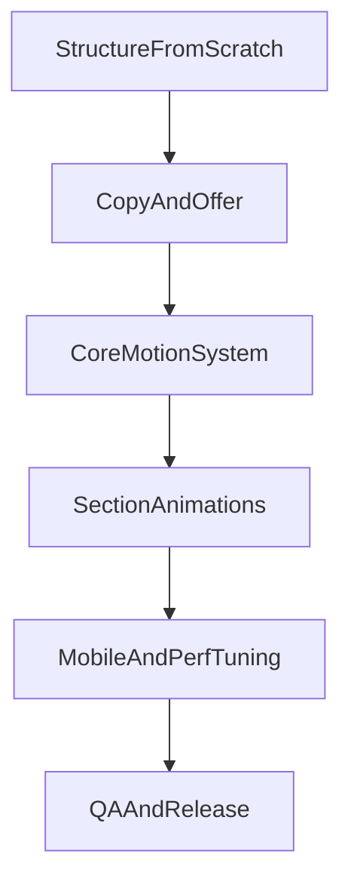

# План перезапуска 8:20 Lab

## Цели и ограничения
- Цель: баланс wow-эффекта и заявок (основной CTA в Telegram).
- Подход: сборка с нуля, перенос лучших смыслов с текущей версии.
- Ограничение: сложные анимации без лагов на средних телефонах.
- Фокус услуг: сайты и визуальная упаковка; блок про Telegram-ботов убираем.

## Новая архитектура страницы
- Пересобрать страницу в 7 блоков:
  - Hero (мощный первый экран + CTA)
  - Value strip (короткие доказательства уровня)
  - Services (2 опоры: сайты и визуальная упаковка)
  - Featured cases (кейсы с динамикой)
  - Principles (подход и качество)
  - Process (прозрачный маршрут работ)
  - Contact CTA (жесткий финальный призыв)
- Упростить навигацию под конверсию: 3-4 пункта максимум + фиксированный CTA.

## Анимационная концепция (wow, но контролируемо)
- Ввести сквозной motion-язык: одна «нить» поведения по всему сайту (единая физика, одинаковые кривые easing, единый темп).
- Для ключевых блоков применить:
  - Hero: layered reveal + depth parallax + text choreography.
  - Cases: scroll-driven transitions и фокусные перестроения карточек.
  - Principles/Process: controlled stagger + micro-interactions.
- Ограничить тяжелые эффекты: использовать progressive enhancement (desktop richer, mobile lighter).
- Добавить fallback для `prefers-reduced-motion`.

## Тексты и позиционирование
- Полностью переписать copy на русском под взрослую подачу:
  - меньше техно-шума,
  - больше бизнес-результата,
  - короткие, точные формулировки.
- Фиксировать единый оффер: сайты на чистом коде + визуальная упаковка бизнеса.
- Убрать все размытые и конфликтующие формулировки, оставить единый тон «точность + эстетика + результат».

## Технический каркас реализации
- Если проект на Next.js App Router, базово пересобрать:
  - [app/page.tsx](app/page.tsx)
  - [app/layout.tsx](app/layout.tsx)
  - [app/globals.css](app/globals.css)
  - [components/sections/Hero.tsx](components/sections/Hero.tsx)
  - [components/sections/Services.tsx](components/sections/Services.tsx)
  - [components/sections/Cases.tsx](components/sections/Cases.tsx)
  - [components/sections/Process.tsx](components/sections/Process.tsx)
  - [components/sections/FinalCta.tsx](components/sections/FinalCta.tsx)
  - [components/motion/MotionProvider.tsx](components/motion/MotionProvider.tsx)
  - [lib/content/site-copy.ts](lib/content/site-copy.ts)
- Все тексты вынести в единый контент-файл для быстрой правки без поломки верстки.
- Настроить image/video asset pipeline (оптимизация, размеры, lazy loading).

## Контроль качества перед релизом
- Проверить:
  - плавность анимаций на desktop/mobile,
  - читаемость заголовков и контраст,
  - скорость LCP/CLS/INP,
  - корректность CTA и ссылок.
- Сделать финальную «полировку»: отступы, сетка, ритм типографики, hover/focus состояния.

## План поставки (этапами)
1. Каркас и финальная структура блоков.
2. Полный copywriting и вставка текста.
3. Внедрение wow-анимаций по приоритету (Hero → Cases → остальное).
4. Mobile-адаптация и performance-полировка.
5. Финальный QA и публикация.

